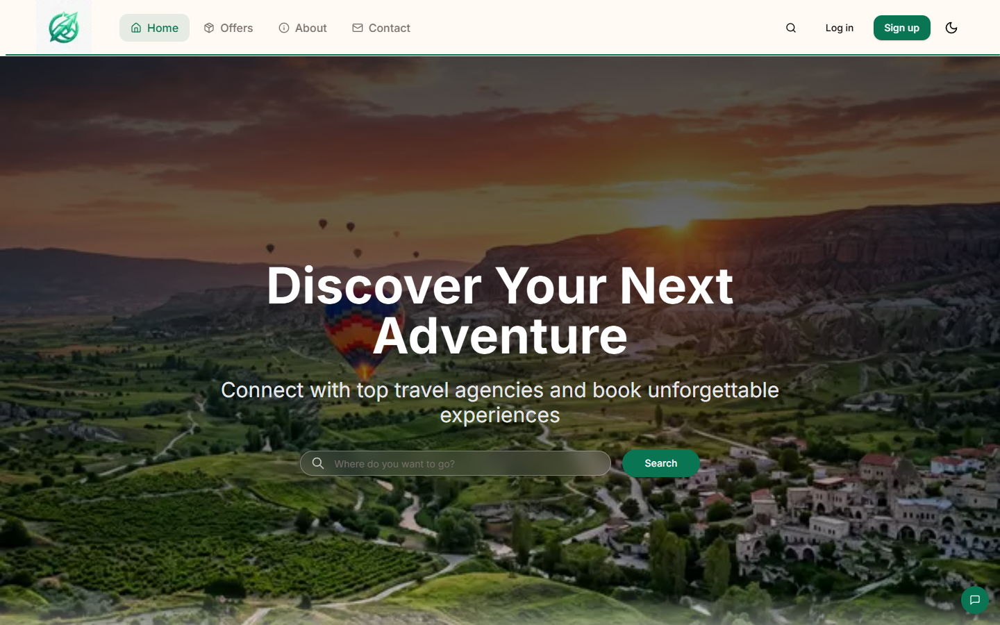
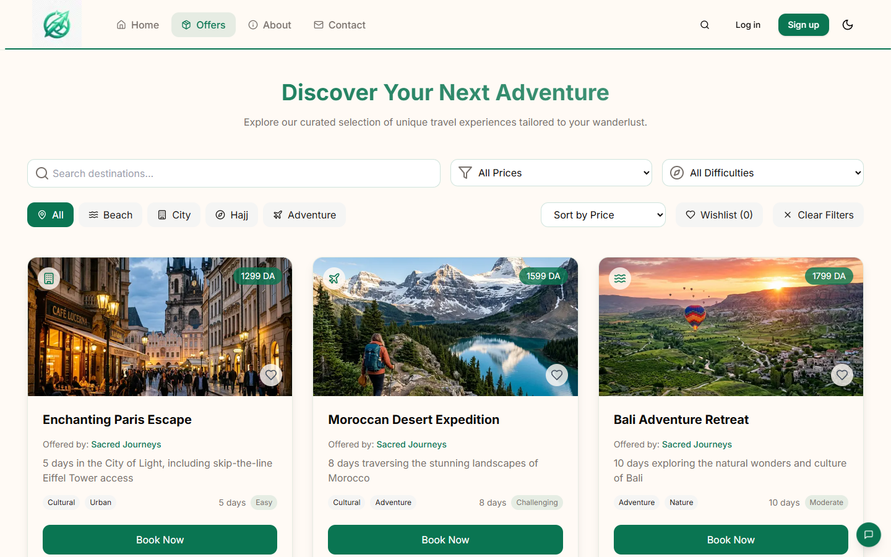
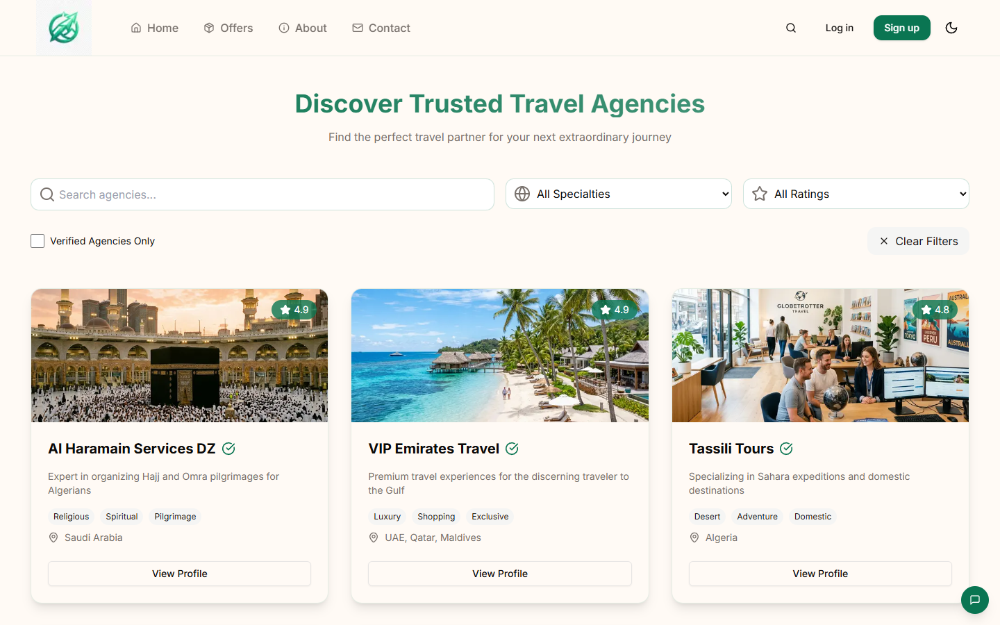
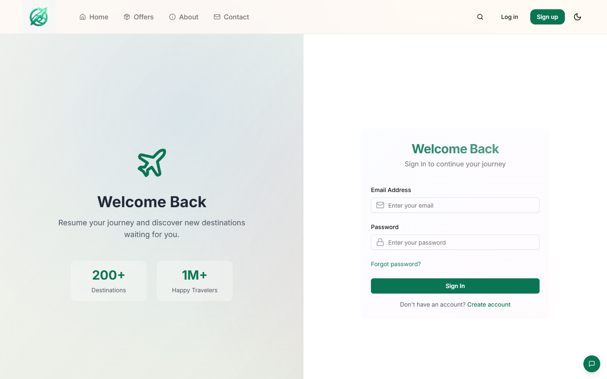
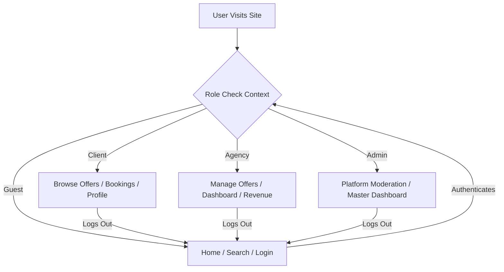

<div align="center">

# 🏖️ N7awsou - Ultimate Travel Booking Platform

### *A premium, next-generation travel platform connecting explorers with the best agencies and unforgettable experiences*

[](https://nextjs.org/)
[](https://react.dev/)
[](https://tailwindcss.com/)
[](https://opensource.org/licenses/MIT)

</div>

---

## 📋 Overview

> **N7awsou** is a comprehensive, modern Next.js web application designed to streamline the travel booking experience. By offering a unified platform for clients, travel agencies, and administrators, N7awsou revolutionizes how trips—from local Algerian adventures to international getaways and religious pilgrimages (Hajj/Omra)—are discovered and booked.

<br>

### ✨ Key Features

<table>
<tr>
<td width="50%">

**🚀 Modern UI/UX**
<br>Stunning interface with Framer Motion animations and responsive design.

**🎭 Multi-Role Architecture**
<br>Dedicated dashboards and flows for Admins, Agencies, and pure Clients.

**🌙 Built-in Theming**
<br>Seamless toggle between Light and Dark modes for comfortable browsing.

</td>
<td width="50%">

**🔍 Advanced Filtering**
<br>Dynamic search by destination, price bounds (DZD), and experience type.

**💼 Agency Profiles**
<br>Directory of verified local and international travel agencies.

**⚡ Blazing Fast**
<br>Powered by Next.js App Router and optimized React rendering.

</td>
</tr>
</table>

---

## 📸 Platform Previews

<div align="center">

### Dynamic Home & Offers



### Agency Directory & Admin Dashboard


</div>

---

## 🚀 Quick Start

### Prerequisites

```
✓ Node.js 18.x or higher
✓ npm package manager (or yarn/pnpm)
```

### Installation

<details open>
<summary><b>📦 Step-by-Step Setup</b></summary>

<br>

**1️⃣ Clone the repository**
```bash
git clone https://github.com/Islamroubache/musafir-box-platform.git
cd musafir-box-platform-main
```

**2️⃣ Install dependencies**
```bash
npm install
```

**3️⃣ Run the development server**
```bash
npm run dev
```

**4️⃣ Access the application**

Open your browser and navigate to `http://localhost:3000`

</details>

---

## 🛠️ Technology Stack

<div align="center">

| Category | Technologies |
|:---------|:-------------|
| **Framework** |  App Router |
| **Frontend** |   |
| **Styling** |  shadcn/ui components |
| **Animations** | Framer Motion |
| **State Management** | React Context API |
| **Icons** | Lucide React |

</div>

---

## 🤖 Platform Architecture

<div align="center">



</div>

---

## 🤝 Contributing

<div align="center">

**Contributions are welcome!** Please feel free to submit a Pull Request.

</div>

### 📝 Contribution Workflow

```bash
# 1. Fork the repository
# 2. Create your feature branch
git checkout -b feature/AmazingFeature

# 3. Commit your changes
git commit -m 'Add some AmazingFeature'

# 4. Push to the branch
git push origin feature/AmazingFeature

# 5. Open a Pull Request
```

---

## 👥 Authors

<div align="center">

<table>
<tr>
<td align="center">
<br>
<sub><b>Islam Roubache</b></sub><br>
🎓 Master's Student in AI & Data Science<br>
📍 Higher School of Computer Science 08 May 1945<br>
Sidi Bel Abbes, Algeria
</td>
</tr>
</table>

</div>

---

## 📧 Contact

<div align="center">

**Questions or Support?**

📧 Email: [i.roubache@esi-sba.dz](mailto:i.roubache@esi-sba.dz)

💬 Open an issue for bug reports or feature requests

</div>

---

<div align="center">

### ⭐ Star this repository if you find it helpful!

<br>

**Made with ❤️ for seamless travel experiences**

</div>
